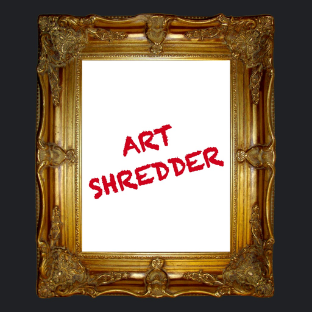

<p align="center">
<a href="https://itunes.apple.com/app/id1439126672?mt=8">
  
</a>
  <b>
    <font size="6">ArtShredder</font>
  </b>
  <a href="https://itunes.apple.com/app/id1439126672?mt=8">
    
  </a>
</p>

ArtShredder reproduces Banksy shredder in iOS Devices.

| Features |
| :- |
| Reproduce shredder animation |
| Output animation as an Image |
| Output animation as a GIF Image |
| Reproduce shredder animation with AR |

| Animation | AR Animation |
| :-: | :-: |
|  |  |

## Usage

```
$ make bootstrap
```

## Requirements

- Xcode 10.1
- Swift 4.2.1
- iOS 11 or greater
- CocoaPods 1.5.3
- Carthage 0.31.2

## Open Source & Copying

ArtShredder is licensed under MIT.
However, please do not ship this app your own account.
