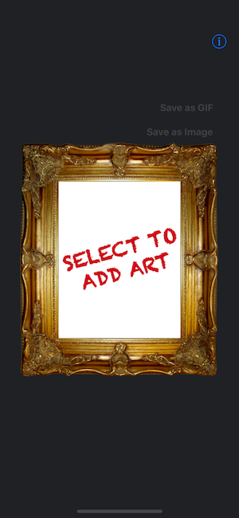
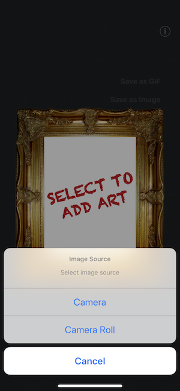
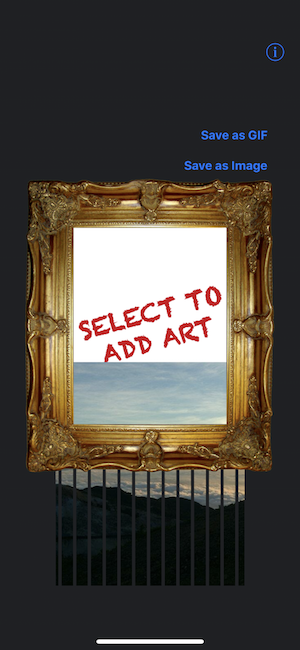
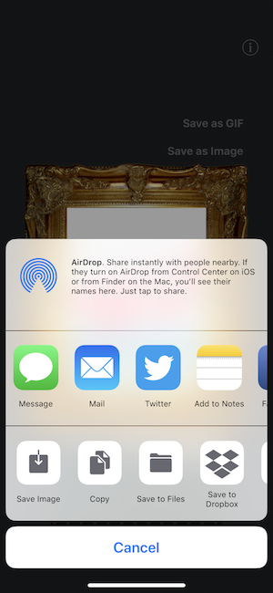

# Support

- [How to select image?](./en#how-to-select-image)
- [How to save as image?](./en#how-to-save-as-image)
- [How to save as GIF?](./en#how-to-save-as-gif)
- [How to share image to SNS?](./en#how-to-share-image-to-sns)

## How to select image?

You can select image with `SELECT TO ADD ART` button.

| 1. Tap `select` button | 2. Select image source | 3. Animated |
| :-: | :-: | :-: |
|  |  |  |

## How to save as image?

You can save image with `Save as Image` button.
It is enabled after animated.

| 1. Tap `Save as Image` button | 2. Select `Save Image` |
| :-: | :-: |
|  |  |

## How to save as GIF?

You can save image with `Save as GIF` button.
It is enabled after animated.

| 1. Tap `Save as GIF` button | 2. Select `Save Image` |
| :-: | :-: |
|  |  |

## How to share image to SNS?

You can share image to SNS with `Save as Image` as `Save as GIF` button.

| 1. Tap `Save` button | 2. Select `Twitter`, `Facebook` and so on  |
| :-: | :-: |
|  |  |
