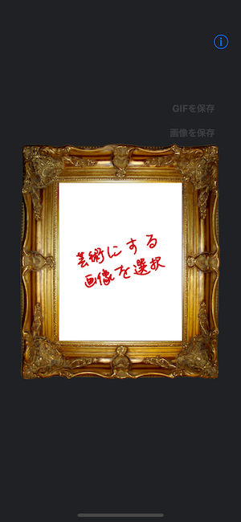
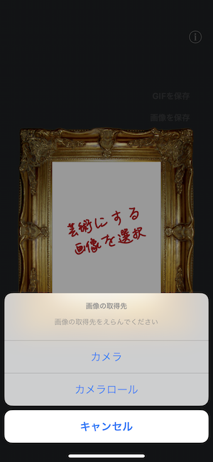
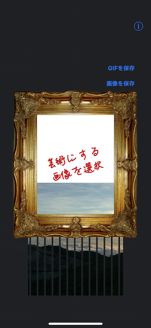
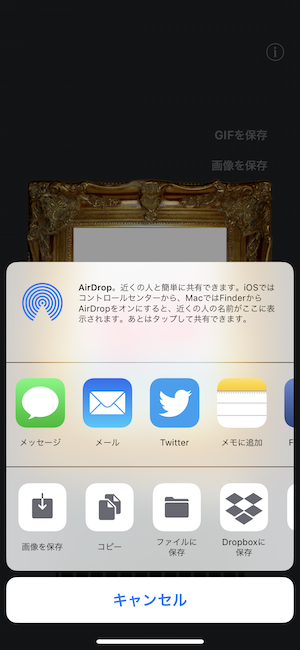

# サポート

- [どうやって画像を選択するか](./jp#どうやって画像を選択するか)
- [どうやって画像を保存するか](./jp#どうやって画像を保存するか)
- [どうやってGIFアニメーションを保存するか](./jp#どうやってgifアニメーションを保存するか)
- [どうやってSNSにシェアするか](./jp#どうやってsnsにシェアするか)

## どうやって画像を選択するか

`芸術にする画像を選択` ボタンから画像を選択することができます。

| 1. `選択` ボタンをタップ | 2. 画像の取得先を選択 | 3. アニメーション開始 |
| :-: | :-: | :-: |
|  |  |  |

## どうやって画像を保存するか

`画像を保存` ボタンで画像を保存することができます。
このボタンは、アニメーション完了後に有効になります。

| 1. `画像を保存` ボタンをタップ | 2. `画像を保存`を選択 |
| :-: | :-: |
|  |  |

## どうやってGIFアニメーションを保存するか

`GIFを保存` ボタンで画像を保存することができます。
このボタンは、アニメーション完了後に有効になります。

| 1. `GIFを保存` ボタンをタップ | 2. `画像を保存`を選択 |
| :-: | :-: |
|  |  |

## どうやってSNSにシェアするか

`画像を保存` または `GIFを保存` ボタンから画像をSNSにシェアすることができます。

| 1. `保存` ボタンをタップ | 2. `Twitter`や `Facebook` などを選択  |
| :-: | :-: |
|  |  |
